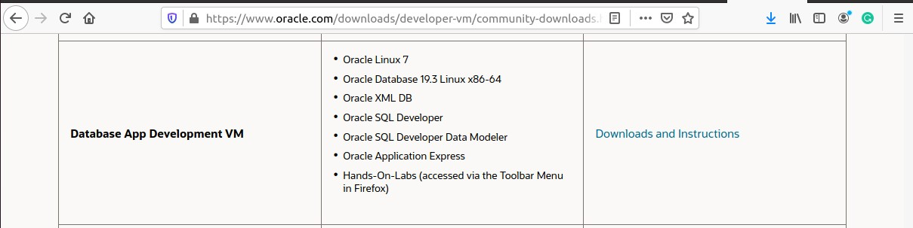
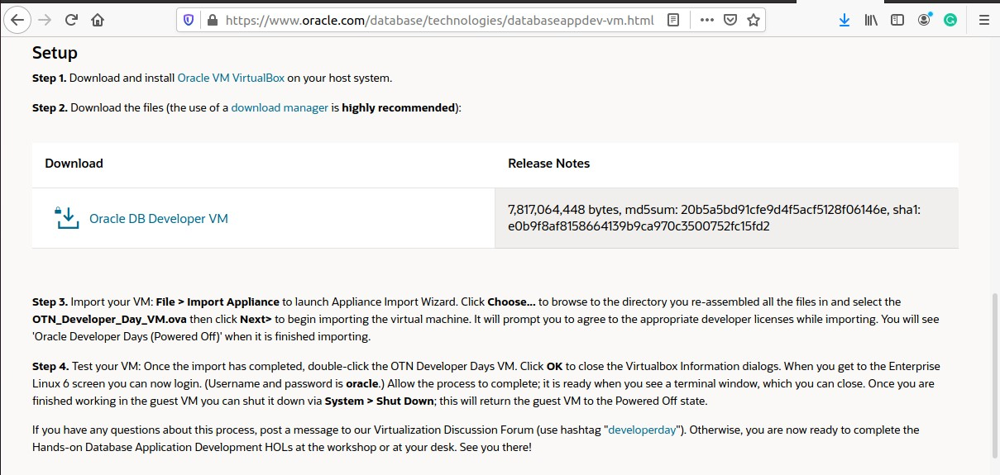

## Oracle Developer VM
To perform a quick test on Oracle database and avoid various installation steps, we could make use of Pre-Built Developer VMs for VirtualBox.

We could download the VM image here:

https://www.oracle.com/downloads/developer-vm/community-downloads.html

You need an Oracle OTN account to login and download.
