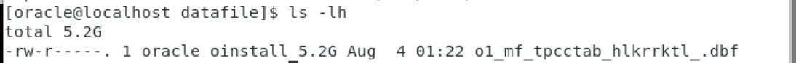

## Preparation
Refer to my other Blog posts to parpare the testing environment:
1. Setup HammerDB for Database Performance Testing in Ubuntu 20 
2. Oracle Database 19.3 Pre-Built VirtualBox Image

## Create 60 warehouses for HammerDB TPC-C Test

It took around 30 mins to build 60 warehouses in my little testing PC running Virtual Box.


Some blocking events when built the warehouses with 10 virtual users, the SSD was not fast enough, IO became bottleneck.


The datafile size is around 5.2 GBytes for 60 warehouses.




## Setup HammerDB

__Enable timed workload__


__Use 3 virtual users to run the test__


## Baseline Test Result


## Enable All DML Audit for HammerDB tables

```
NOAUDIT POLICY dml_policy;
DROP AUDIT POLICY dml_policy ;
CREATE AUDIT POLICY dml_policy ACTIONS 
    all on TPCC.CUSTOMER,
    all on TPCC.DISTRICT,
    all on TPCC.HISTORY,
    all on TPCC.ITEM,
    all on TPCC.WAREHOUSE,
    all on TPCC.STOCK,
    all on TPCC.ORDERS,
    all on TPCC.NEW_ORDER,
    all on TPCC.ORDER_LINE;
    
AUDIT policy dml_policy;
SELECT * FROM AUDIT_UNIFIED_POLICIES WHERE POLICY_NAME='DML_POLICY';
SELECT * FROM AUDIT_UNIFIED_ENABLED_POLICIES;
SELECT * FROM UNIFIED_AUDIT_TRAIL where unified_audit_policies='DML_POLICY';

```

## Test Result After Enable All DML Audit for HammerDB tables


IO became bottleneck:


Audit SQL became top SQL and affected the database performance:


## Enable Select Audit for HammerDB tables

```
NOAUDIT POLICY dml_policy;
DROP AUDIT POLICY dml_policy ;
CREATE AUDIT POLICY dml_policy ACTIONS 
    select on TPCC.CUSTOMER,
    select on TPCC.DISTRICT,
    select on TPCC.HISTORY,
    select on TPCC.ITEM,
    select on TPCC.WAREHOUSE,
    select on TPCC.STOCK,
    select on TPCC.ORDERS,
    select on TPCC.NEW_ORDER,
    select on TPCC.ORDER_LINE;
    
AUDIT policy dml_policy;
SELECT * FROM AUDIT_UNIFIED_POLICIES WHERE POLICY_NAME='DML_POLICY';
SELECT * FROM AUDIT_UNIFIED_ENABLED_POLICIES;
SELECT * FROM UNIFIED_AUDIT_TRAIL where unified_audit_policies='DML_POLICY';

```

## Test Result After Enable all DML Audit for HammerDB tables


## Summary

* IO became bottleneck in my little testing Virtual Box environment running single disk SSD
* Audit activities became top SQL after enable DML audit
* Significant drop of HammerDB NOPM after enable DML audit 
* Time profile show response time increase (P95%) after enable DML audit 


|      | Baseline (No Audit) | Audit ALL DML   | Audit Select Only     |
| ---------- | ---------- | ---------- | ---------- |
| HammerDB NOPM  | 6105       | 1840 | 4704     |
| neword   | P95%-19.235 |P95%-57.292  | P95%-45.501       |
| payment  | P95%-15.182| P95%-39.682  | P95%-30.438       |
| delivery | P95%-25.003| P95%-55.637  | P95%-52.812       |
| ostat  | P95%-4.969 | P95%-22.710    | P95%-20.862       |
| slev  | P95%-4.915 | P95%-17.613     | P95%-23.398       |
| gettimestamp | P95%-0.015 | P95%-0.014  | P95%-0.014       |
