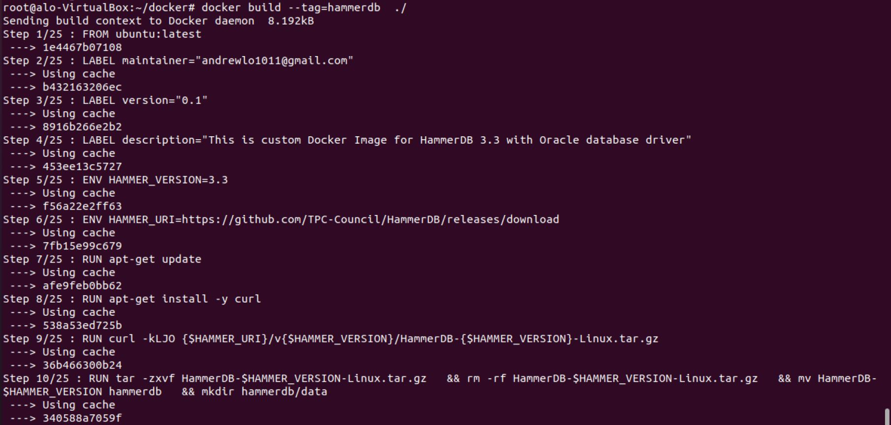
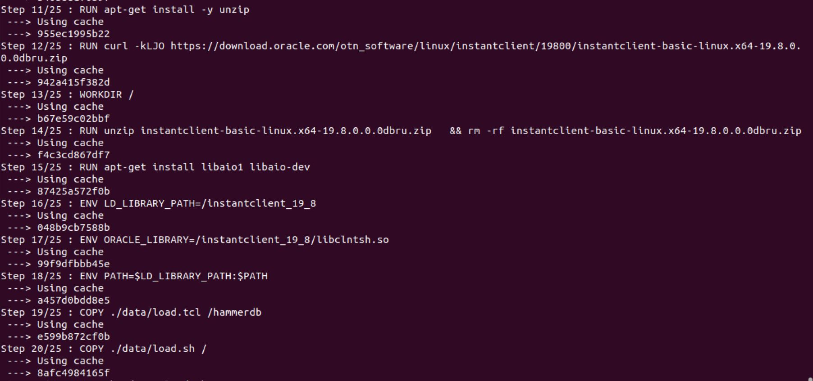
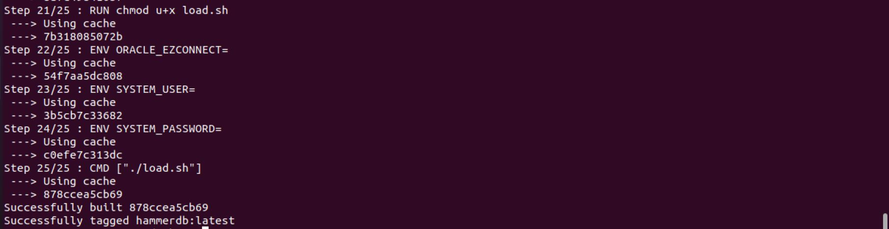
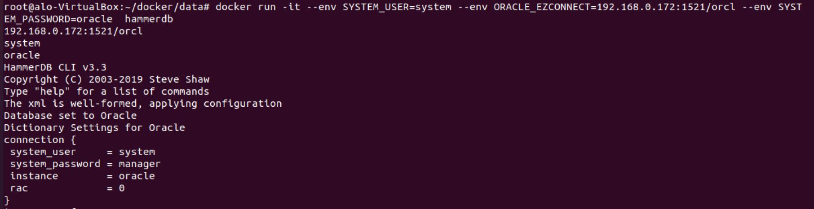
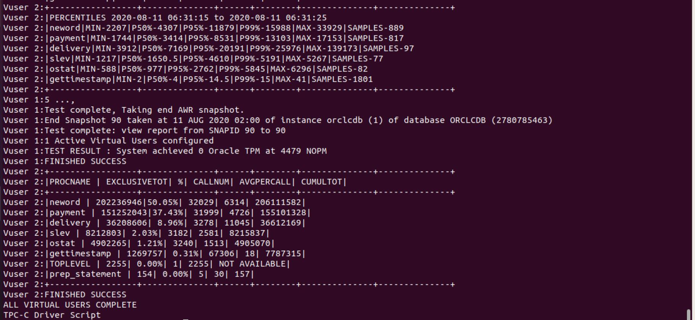
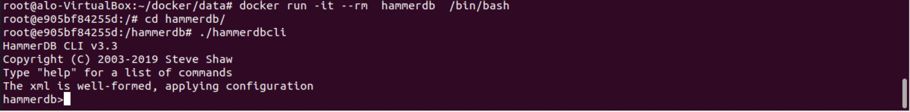

To create HammerDB docker image, we need to install docker first. As there are many documents on the Internet to describe how to install docker, I skip the installation step in this blog post.

## Files to build the images
I created 3 files to build the image: 

### Dockerfile

We provide Dockerfile to docker to build the docker image. There are few existing HammerDB images in Docker Hub, but I don't find one come with Oracle driver. Therefore, I take reference with HammerDB images in Docker Hub with my experience to install HammerDB with Oracle driver in Ubuntu to come up with this Dockerfile.

- Build the image with ubuntu:latest image
- Install curl, unzip and libaio library
- Download HammerDB 3.3 and install
- Download Oracle instant client 19.3 and install
- Copy load.tcl, load.sh to the image
- Run load.sh 

### load.tcl 

- This is a HammerDB script to run timed TPC-C workload with 1, 2 and 3 virtual users. Schema and warehouse build is not included in this script. 


### load.sh

- This is a shell script called by the container, which replace the database user, password and easy connect string with the environment variables passed from the caller. It starts the hammerdbcli and call load.tcl


P.S. Oracle Easy Connect String, Username and Password are defined in environment variables which will be passed from the caller


__Dockerfile__

```
FROM ubuntu:latest

# LABEL about the custom image
LABEL maintainer="andrewlo1011@gmail.com"
LABEL version="0.1"
LABEL description="This is custom Docker Image for \
HammerDB 3.3 with Oracle database driver"

# HammerDB
ENV HAMMER_VERSION=3.3
ENV HAMMER_URI=https://github.com/TPC-Council/HammerDB/releases/download

RUN apt-get update
RUN apt-get install -y curl
RUN curl -kLJO {$HAMMER_URI}/v{$HAMMER_VERSION}/HammerDB-{$HAMMER_VERSION}-Linux.tar.gz
RUN tar -zxvf HammerDB-$HAMMER_VERSION-Linux.tar.gz \
  && rm -rf HammerDB-$HAMMER_VERSION-Linux.tar.gz \
  && mv HammerDB-$HAMMER_VERSION hammerdb \
  && mkdir hammerdb/data

# Oracle Instant Client 19.8
RUN apt-get install -y unzip
RUN curl -kLJO https://download.oracle.com/otn_software/linux/instantclient/19800/instantclient-basic-linux.x64-19.8.0.0.0dbru.zip
WORKDIR /
RUN unzip instantclient-basic-linux.x64-19.8.0.0.0dbru.zip \
  && rm -rf instantclient-basic-linux.x64-19.8.0.0.0dbru.zip
RUN apt-get install libaio1 libaio-dev

ENV LD_LIBRARY_PATH=/instantclient_19_8
ENV ORACLE_LIBRARY=/instantclient_19_8/libclntsh.so
ENV PATH=$LD_LIBRARY_PATH:$PATH

COPY ./data/load.tcl /hammerdb
COPY ./data/load.sh /
RUN chmod u+x load.sh

ENV ORACLE_EZCONNECT=
ENV SYSTEM_USER=
ENV SYSTEM_PASSWORD=

CMD ["./load.sh"]

```


__load.tcl__
```
#!/usr/bash
####
dbset db ora

print dict
dbset db ora
dbset bm TPC-C
diset connection system_user SYSTEM_USER 
diset connection system_password SYSTEM_PASSWORD
diset connection instance ORACLE_EZCONNECT 
diset tpcc ora_driver timed
diset tpcc timeprofile true
print dict

loadscript
### Round 1
vuset vu 1
vuset logtotemp 1
vuset unique 1
vuset timestamps 1
print vuconf

vucreate
vustatus
vurun
sleep 500
### Round 2
vudestroy
vuset vu 2
print vuconf

vucreate
vustatus
vurun
sleep 500

### Round 3
vudestroy
vuset vu 3
print vuconf

vucreate
vustatus
vurun
sleep 500
```

__load.sh__

```
#!/bin/bash
echo $ORACLE_EZCONNECT
echo $SYSTEM_USER
echo $SYSTEM_PASSWORD

sed -i -e "s#ORACLE_EZCONNECT#$ORACLE_EZCONNECT#g" /hammerdb/load.tcl 
sed -i -e "s#SYSTEM_PASSWORD#$SYSTEM_PASSWORD#g" /hammerdb/load.tcl 
sed -i -e "s#SYSTEM_USER#$SYSTEM_USER#g" /hammerdb/load.tcl 

cd /hammerdb
./hammerdbcli auto load.tcl
```


## Build the docker image
docker build --tag=hammerdb  ./





## Run the docker image

Run the docker image with load.sh script:

```
docker run -it --env SYSTEM_USER=system --env ORACLE_EZCONNECT=192.168.0.172:1521/orcl --env SYSTEM_PASSWORD=oracle hammerdb
```




Run the docker image with bash and call hammdbcli:

```
docker run -it --rm hammerdb /bin/bash
```


