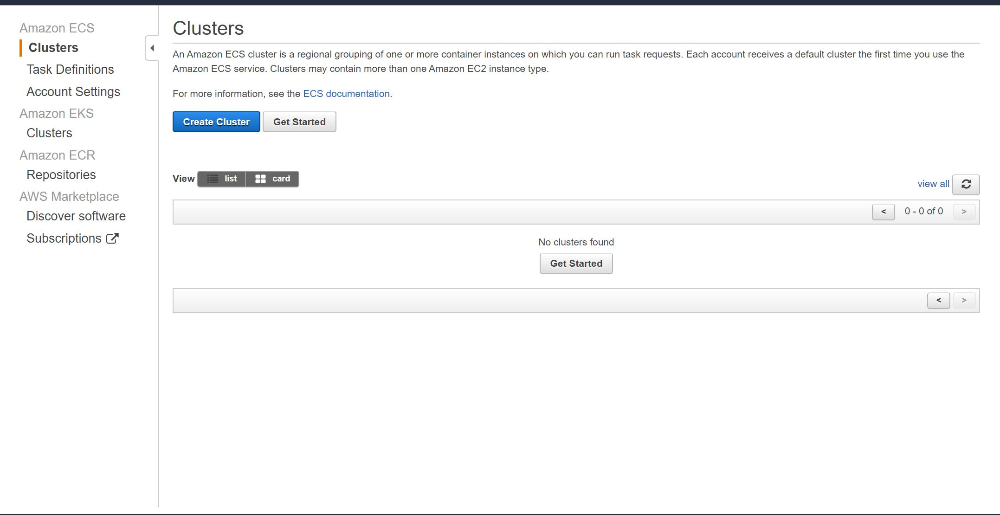
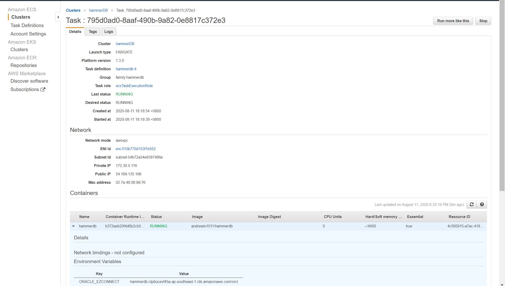

## Push the HammerDB Image to Docker Hub
Create a [docker hub account](https://hub.docker.com/signup) and [repository](https://docs.docker.com/docker-hub/repos/#creating-repositories) if you don't have.


Run following command to tag the hammerdb image and push to docker hub a public repository. 

P.S. Please replace my repository with your repository

```
docker tag hammerdb andrewlo1011/hammerdb
docker push andrewlo1011/hammerdb
```


## Create ECS Cluster
__NOTE: We will create AWS resources that incur costs. It is chargeable, please be aware.__

Create an ECS cluster as below:



Pick the Fargate ECS type, which don't need to maintain our own EC2.
It is kind of serverless ECS.


Enable Container Insights for CPU usage monitoring. 


## Create Task and Container definition

Select Fargate launch type:


Task Size: 2 vCPU and 4G Memory


Add the hammerdb Container from docker hub to the definition:


Add the environment variables for Oracle easy connection string, database username and password: 


Add the awslog configuration, so that we could view the log in CloudWatch.


Continue to create task definition:


## Run the hammerdb Task definition


In the environment variables override, set the Oracle RDS connection string, system username and password.

P.S. 
The step to create the testing RDS Oracle database is not included here.
Also the HammerDB user creation and warehouse build in the database also not included here.





## Round 1 Task Execution Result
The round 1 test was executed with 1, 2, 3 virtual users respectively.
However, after review the database statistic for 3 virtual users, I found that the database loading was a bit low. 
After review, I found that load.tcl has an typo for the 3rd part of the test, it was set to 1 virtual user.


## Round 2 Task Execution Result
I fixed the load.tcl script and increased the virtual users in the script.
I rebuilt the image and push to docker hub again.
The round 2 test was executed with 3, 4, 5 virtual users 
It seems that the current RDS sizing the performance was saturated at 3 virtual users. 


