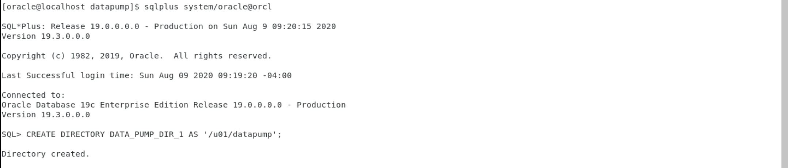
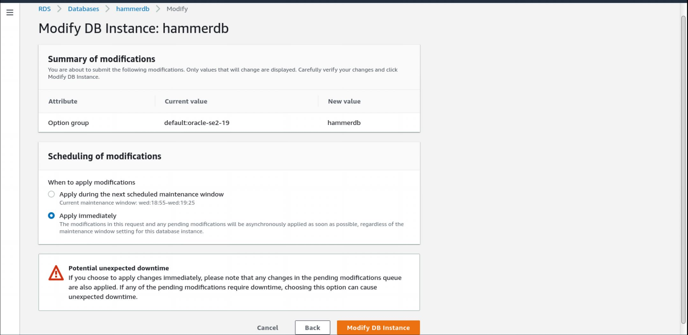

Move the HammerDB testing database to AWS from the local Virtual Box Oracle development image. It could provide a better testing platform as it can scale up without limit if you willing to pay. (Yes, it has limit, but it is much much higher than what I need.) 

## Create RDS Database for Testing

__NOTE: We will create AWS resources that incur costs. It is chargeable, please be aware.__


Create a AWS RDS Oracle database after login AWS console: 


Standard Edition 2 (licence included) should be good enough for this testing.
Select Dev/Test database template:


Pick the CPU type that you like, it can be changed afterward:


20GB should be large enough.

P.S. 25GB is not enough for build in SELECT Audit test. Need to increase to 50GB at the end.


No backup and Encryption is needed for this testing database:


Enable Performance insights and enhanced monitoring to collect performance information:


## Export TPCC schema from the existing HammerDB database

I have an existing HammerDB testing database in my VirtualBox Oracle development VM. It contains a TPCC schema and 60 warehouses. To save time to build the TPCC schema and warehouses in AWS RDS. I decide to export the schema using Oracle datadump export (expdp) and upload the dump to S3. I will import the data to AWS RDS later using datadump import (impdp)

In the VirtualBox Oracle development VM, execute following commands in sqlplus to create a directory and expdp:

```
CREATE DIRECTORY DATA_PUMP_DIR_1 AS '/u01/datapump';
```



```
DECLARE
hdnl NUMBER;
BEGIN
hdnl := DBMS_DATAPUMP.OPEN( operation => 'EXPORT', job_mode => 'SCHEMA', job_name=>null);
DBMS_DATAPUMP.ADD_FILE( handle => hdnl, filename => 'tpcc.dmp', directory => 'DATA_PUMP_DIR_1', filetype => dbms_datapump.ku$_file_type_dump_file);
DBMS_DATAPUMP.ADD_FILE( handle => hdnl, filename => 'tpcc_exp.log', directory => 'DATA_PUMP_DIR_1', filetype => dbms_datapump.ku$_file_type_log_file);
DBMS_DATAPUMP.METADATA_FILTER(hdnl,'SCHEMA_EXPR',' IN (''TPCC'')');
DBMS_DATAPUMP.START_JOB(hdnl);
END;
/  
```


Create a S3 bucket and upload the expdp dump.


## Set up S3 integration in the RDS

Create an IAM policy to allow Amazon RDS access to an Amazon S3 bucket:


Create an IAM role to allow Amazon RDS access to an Amazon S3 bucket:


In the RDS console, associate your IAM role with your DB instance:


Configure an option group for Amazon S3 integration:


Need to restart the database to apply the option group.


Download the expdb dump Files from the Amazon S3 Bucket to the Oracle DB Instance:
Connect to the RDS via SQLDeveloper, run following SQL:

```
SELECT rdsadmin.rdsadmin_s3_tasks.download_from_s3(
      p_bucket_name    =>  'hammerdb-expdp',       
      p_directory_name =>  'DATA_PUMP_DIR') 
   AS TASK_ID FROM DUAL;  
```


To read the log file, run following SQL:
```
SELECT text FROM table(rdsadmin.rds_file_util.read_text_file('BDUMP','dbtask-1597064157117-203.log'));                
            
```


After the expdp dump uploaded to database, run following SQL to create the TPCCTAB tablespace:
```
CREATE TABLESPACE TPCCTAB;
```
Run the impdb to import the TPCC schema:

```
DECLARE
hdnl NUMBER;
BEGIN
hdnl := DBMS_DATAPUMP.OPEN( operation => 'IMPORT', job_mode => 'SCHEMA', job_name=>null);
DBMS_DATAPUMP.ADD_FILE( handle => hdnl, filename => 'tpcc.dmp', directory => 'DATA_PUMP_DIR', filetype => dbms_datapump.ku$_file_type_dump_file);
DBMS_DATAPUMP.ADD_FILE( handle => hdnl, filename => 'tpcc_imp.log', directory => 'DATA_PUMP_DIR', filetype => dbms_datapump.ku$_file_type_log_file);
DBMS_DATAPUMP.METADATA_FILTER(hdnl,'SCHEMA_EXPR','IN (''TPCC'')');
DBMS_DATAPUMP.START_JOB(hdnl);
END;
/  
```


Read the impdp status and read the impdp dump logfile:

```
SELECT * from DBA_DATAPUMP_JOBS;
SELECT text FROM table(rdsadmin.rds_file_util.read_text_file('DATA_PUMP_DIR','tpcc_imp.log'));                           
```


The TPCC schema is loaded to the Oracle RDS database and we could use it for HammerDB TPCC test.

__Remember to terminate the instance when the testing is complete, if the instance is running, AWS will continue to charge you. You could stop the instance, but there will be a certain amount of charges for the storage for the database.__