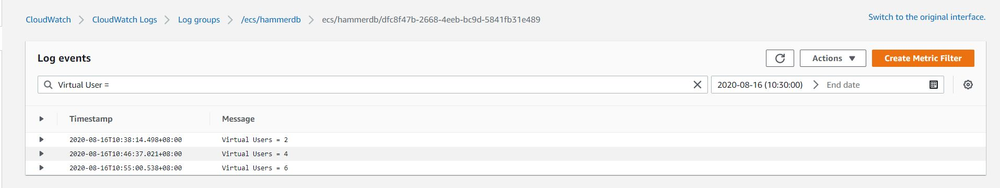
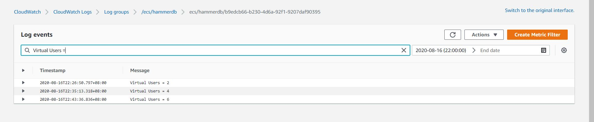
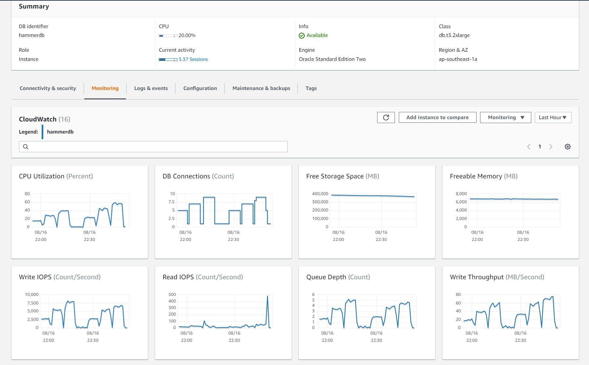

After several preparation steps as below, it's time to bring it all together:
1. [Create a HammerDB Docker Image with Oracle Driver](https://drew.vip/Create-a-HammerDB-Docker-Image-with-Oracle-Driver/)
2. [Deploy a HammerDB Docker Image to AWS ECS](https://drew.vip/Deploy-HammerDB-Docker-Image-to-AWS-ECS/)
3. [Setup a Testing AWS RDS Oracle Database](https://drew.vip/Setup-HammerDB-Testing-AWS-RDS-Oracle-Database/)

We ran HammerDB on AWS RDS with Oracle built-in table audit, here was the testing result.

## Test round 1,  db.t3.xlarge, General Purpose SSD

Database Configuration:
1. db.t3.xlarge (4 vCPU, 16G RAM)
2. General Purpose SSD (50G)


ECS Fargate:


__Test Result:__

Ran the test with 2, 4 and 6 virtual users


The system quickly saturated at 6 virtual users.

| Virtual Users   | NOPM  |
| ---------- | ---------- | 
| 2 VU       |  23838     |
| 4 VU       |  28243     |
| 6 VU       |  39273     |


__Database and ECS Statistic:__


## Baseline test,  db.t3.2xlarge, Provisioned IOPS SSD

1. db.t3.2xlarge (8 vCPU, 32G RAM)
2. Provisioned IOPS SSD (20000 IOPS, 400G)

P.S. 
Convert from General Purpose SSD (50G) to Provisioned IOPS SSD (20000 IOPS, 400G) took around an hour. 
Provisioned IOPS SSD was quite expensive and I were busy at the time it just completed the conversion. At the end, I terminated the original instance after convert to Provisioned IOPS SSD and rebuilt the instance with db.t3.2xlarge at a later time.


__Baseline Test Result:__

Ran the test with 2, 4 and 6 virtual users
No bottleneck was observed for this run.

| Virtual Users   | NOPM  |
| ---------- | ---------- | 
| 2 VU       |  26824     |
| 4 VU       |  50513     |
| 6 VU       |  69078     |


__Database and ECS Statistic:__


## Audit Select on TPCC Tables,  db.t3.2xlarge, Provisioned IOPS SSD

1. db.t3.2xlarge (8 vCPU, 32G RAM)
2. Provisioned IOPS SSD (20000 IOPS, 400G)

Before ran the test, enabled audit on TPCC tables as below:

```
NOAUDIT POLICY dml_policy;
DROP AUDIT POLICY dml_policy ;
CREATE AUDIT POLICY dml_policy ACTIONS 
    select on TPCC.CUSTOMER,
    select on TPCC.DISTRICT,
    select on TPCC.HISTORY,
    select on TPCC.ITEM,
    select on TPCC.WAREHOUSE,
    select on TPCC.STOCK,
    select on TPCC.ORDERS,
    select on TPCC.NEW_ORDER,
    select on TPCC.ORDER_LINE;
    
AUDIT policy dml_policy;
```


__Test Result:__
Ran the test with 2, 4 and 6 virtual users.

We only achieved around 38%-30% of baseline test with same configuration:

| Virtual Users   | NOPM  |
| ---------- | ---------- | 
| 2 VU       |  10116     |
| 4 VU       |  17370     |
| 6 VU       |  20443     |


__Database and ECS Statistic:__

We didn't fully utilize either the CPU or IOPS, however, the overall result was significantly impacted as well. 


## Audit All on TPCC Tables,  db.t3.2xlarge, Provisioned IOPS SSD

1. db.t3.2xlarge (8 vCPU, 32G RAM)
2. Provisioned IOPS SSD (20000 IOPS, 400G)

Before ran the test, enabled audit on TPCC tables as below:

```
NOAUDIT POLICY dml_policy;
DROP AUDIT POLICY dml_policy ;
CREATE AUDIT POLICY dml_policy ACTIONS 
    all on TPCC.CUSTOMER,
    all on TPCC.DISTRICT,
    all on TPCC.HISTORY,
    all on TPCC.ITEM,
    all on TPCC.WAREHOUSE,
    all on TPCC.STOCK,
    all on TPCC.ORDERS,
    all on TPCC.NEW_ORDER,
    all on TPCC.ORDER_LINE;
    
AUDIT policy dml_policy;
```


__Test Result:__

Ran the test with 2, 4 and 6 virtual users.

We only achieved around 24%-19% of baseline test with same configuration:

| Virtual Users   | NOPM  |
| ---------- | ---------- | 
| 2 VU       |  6384     |
| 4 VU       |  10519     |
| 6 VU       |  12785     |




__Database and ECS Statistic:__

We didn't fully utilize either the CPU or IOPS, however, the overall result was significantly impacted. 



## Conclusion and Observation:


1. We could built a testing environment very quickly in AWS RDS and the platform was far better than my single PC running database on Virtual Box.
2. The RDS cost for this testing was around USD30, the cost of Provisioned IOPS SSD contributed to a major portion of the cost. I terminated the instance right after testing in order to save cost.
3. ECS Fargate was prefect for testing, I didn't even need to think about terminate the EC2 after testing.
4. Enable Select or All audit on all application tables would significantly impact the application performance, even the hardware resources (CPU and Disk IO) were not fully saturated. The situation would be even worst If the hardware resource was already reach the bottleneck before enabled audit.
