[Oracle Audit Vault and Database Firewall](https://docs.oracle.com/en/database/oracle/audit-vault-database-firewall/20/index.html) provides a comprehensive Database Activity Monitoring (DAM) solution.
 
__As Per Oracle AVDF documentation:__

>To use the Monitoring ([Host Monitor](https://docs.oracle.com/en/database/oracle/audit-vault-database-firewall/20/sigad/db_firewall.html#GUID-5F90FCE2-2929-4C71-B187-45DB32731F00) ) deployment mode with Oracle Database Firewall, an Oracle Audit Vault Agent and Host Monitor are installed on the target database. The Host Monitor sniffs the traffic from the network interface card based on the configuration and then securely forwards the SQL traffic to the database firewall.
> 
>Oracle Database Firewall supports an Oracle Audit Vault Agent that only monitors and is deployed by the Oracle Audit Vault server. This deployment option provides more flexibility in terms of monitoring at the network point. Using the Monitoring (Host Monitor) mode is helpful in situations where it is not easy to use any of the previously described Oracle Audit Vault and Database Firewall networking options.

To test Oracle AVDF and evaluate the performance impact of DAM, we setup Oracle Audit Vault Agent and Host Monitor in the Oracle Development VM Virtual Box image. Oracle Audit Vault and Database Firewall also installed before the performance testing. 

## Oracle AVDF Setup

Database Firewall was installed 
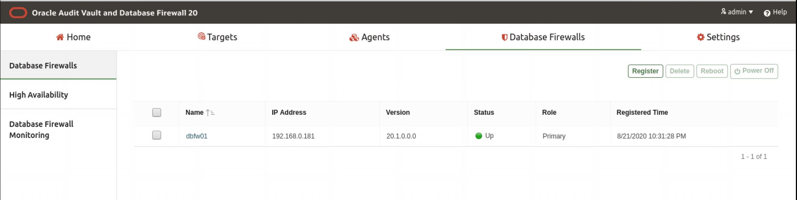

Oracle Audit Vault Agent and Host Monitor was installed and running in the Oracle Developer VM
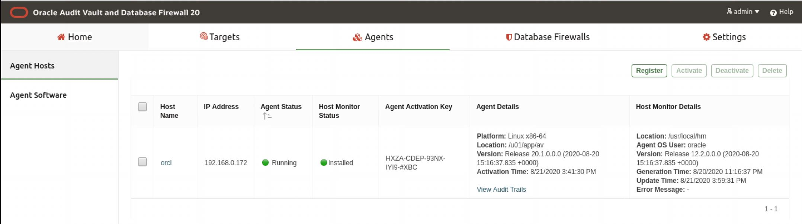

## Oracle AVDF Policy Setup

1. A Target was setup for the Oracle Development VM
2. A Monitoring Point was added for the Host Monitor 
3. A Network Audit Trail was setup to collect the SQL from the network

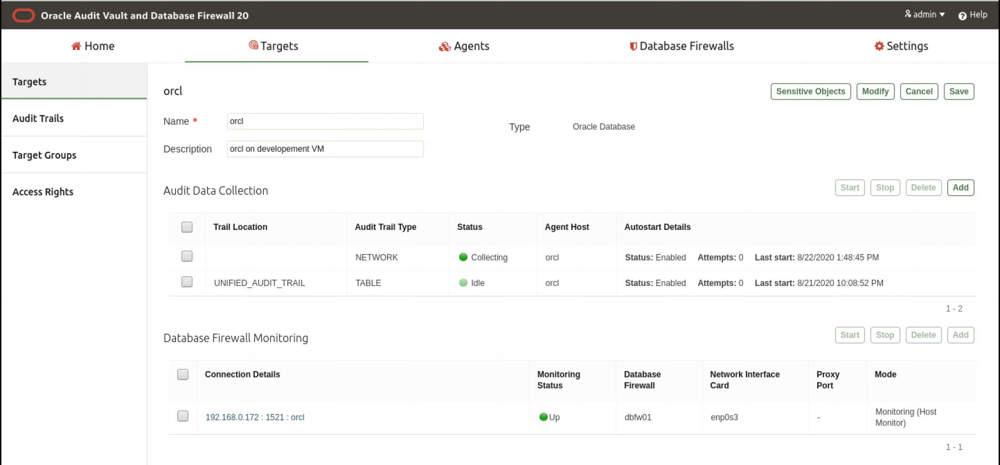

4. The Database Firewall Policy was setup to log all traffic
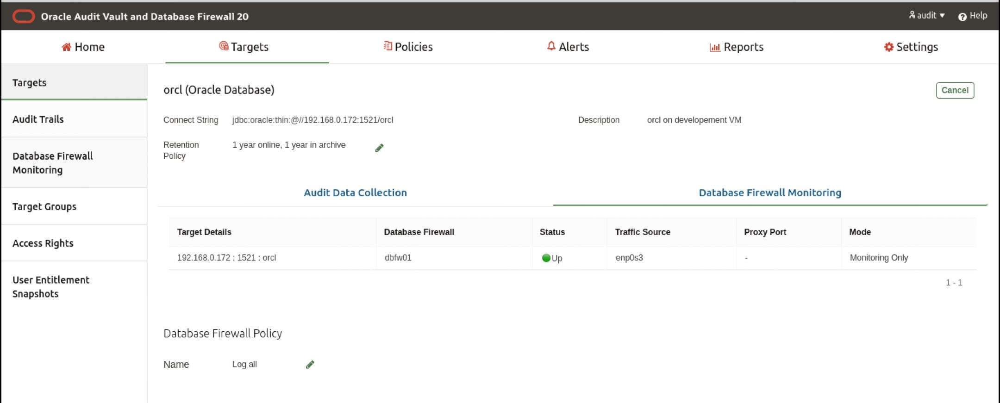

## HammerDB Testing Result

Stopped the Audit Vault Agent and ran 3 virtual users baseline test, we ran the test 2 times to observe the result.

1st ran result, 5474 NOPM:
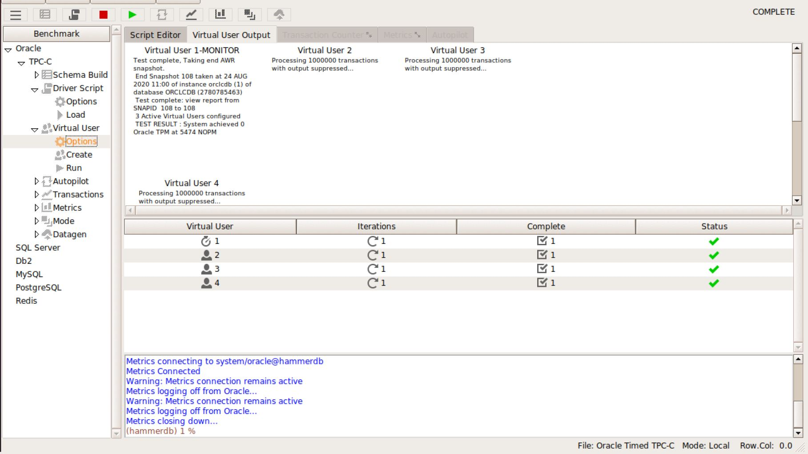

2nd ran result, 5416 NOPM:
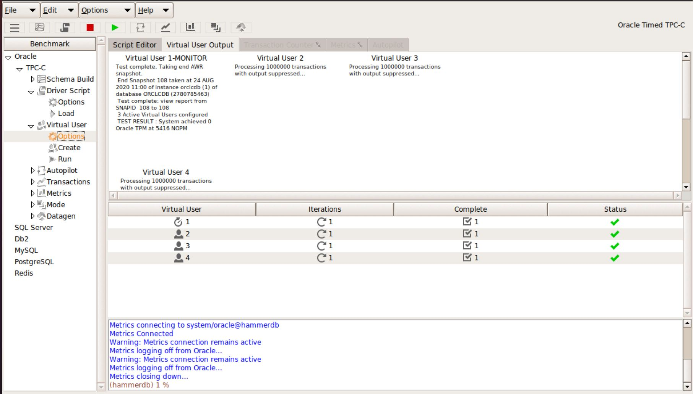

Started the Audit Vault Agent and ran 3 virtual users test, we ran the test 2 times to observe the result.

1st ran result, 5128 NOPM:
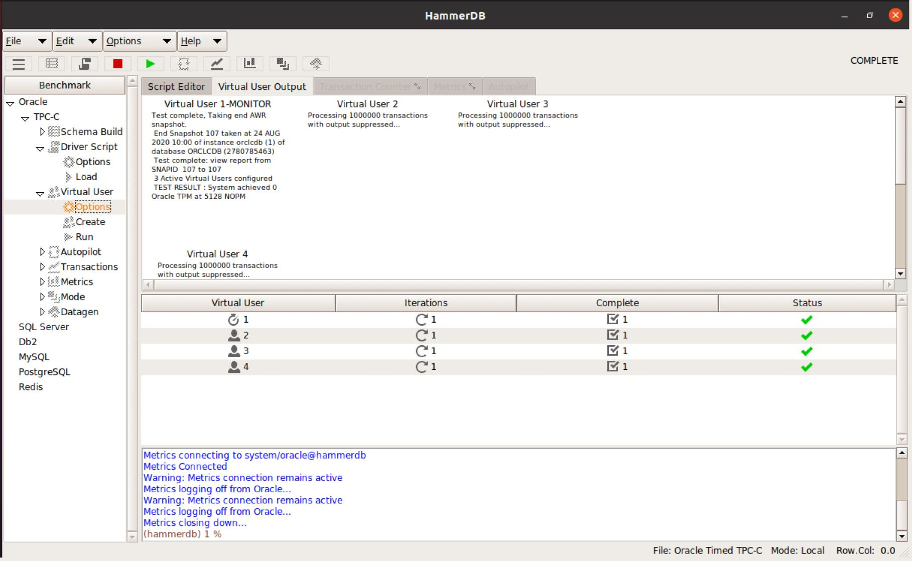

2nd ran result, 5735 NOPM:
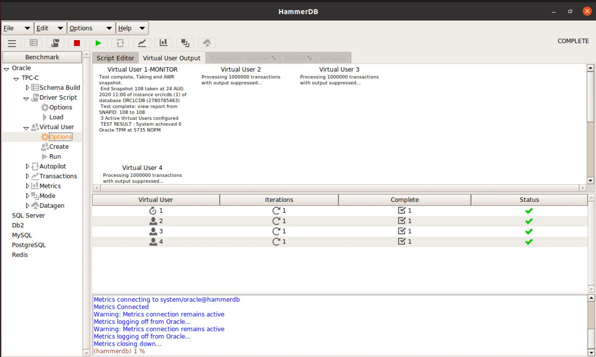

It seems that the AVDF didn't has much impact on the database performance. 

## SQL Captured during the test
The following were the result captured for one of the HammerDB performance test.
Only few SQL captured under user tpcc, which was the user for HammerDB.

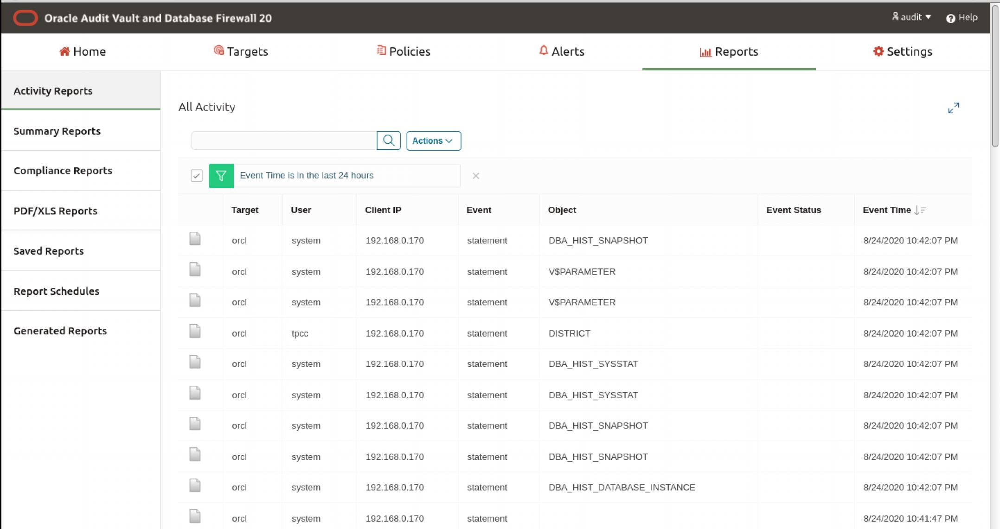
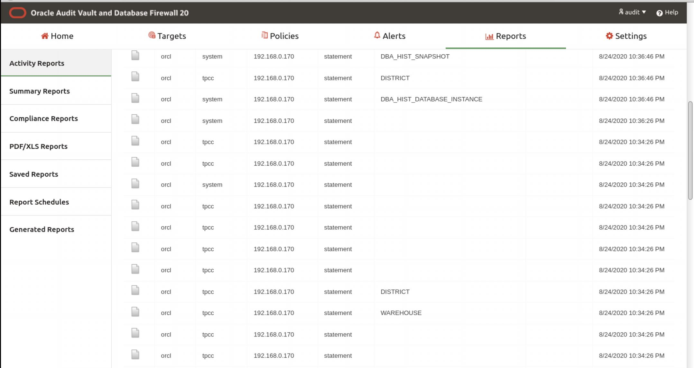
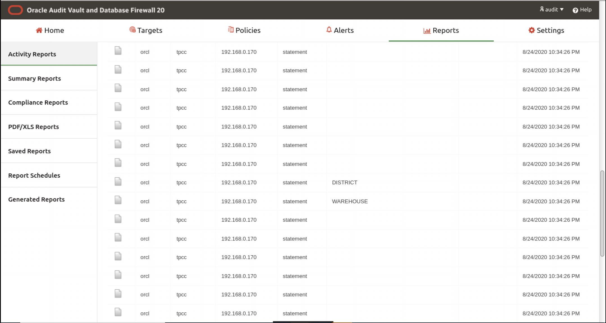
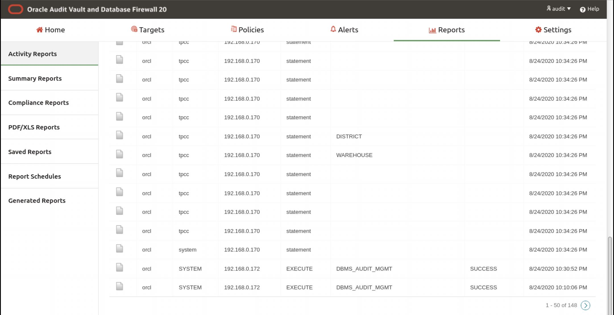

We exported the result to an csv file, it was quite clear that 3 set of same SQL statements were executed by 3 virtual users. Originally, I don't expect this result, I were expected an result like database audit which would log millions of SQL for the hammerDB performance test. 

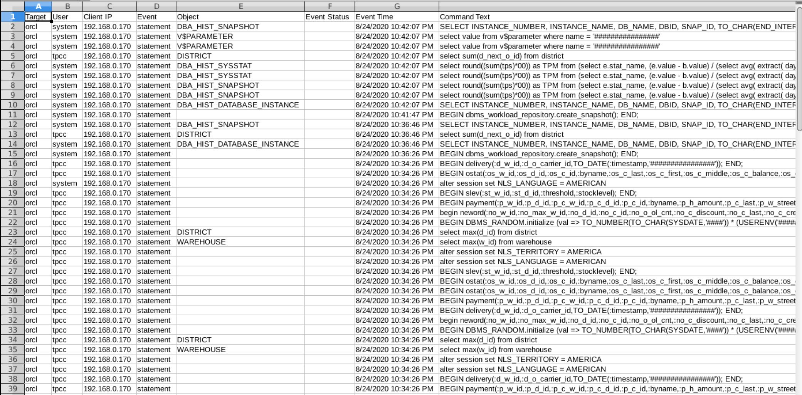
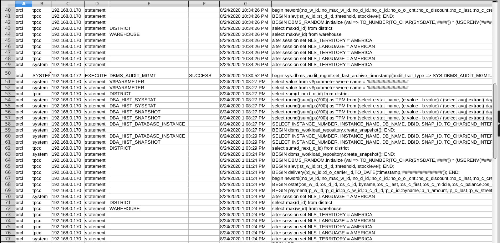

In order to understand what was happened, we ran a tcpdump to capture network traffic when we ran the HammerDB performance test, the script could capture select statements from the network traffic.

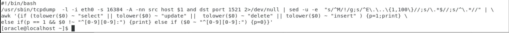
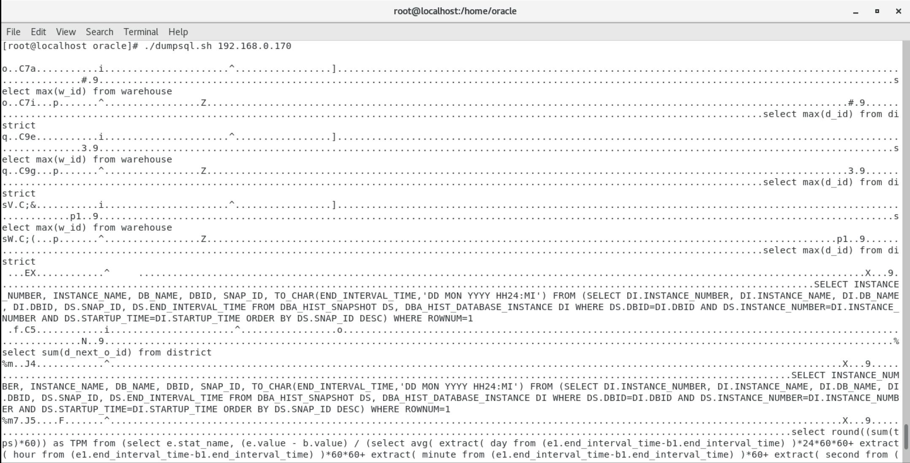
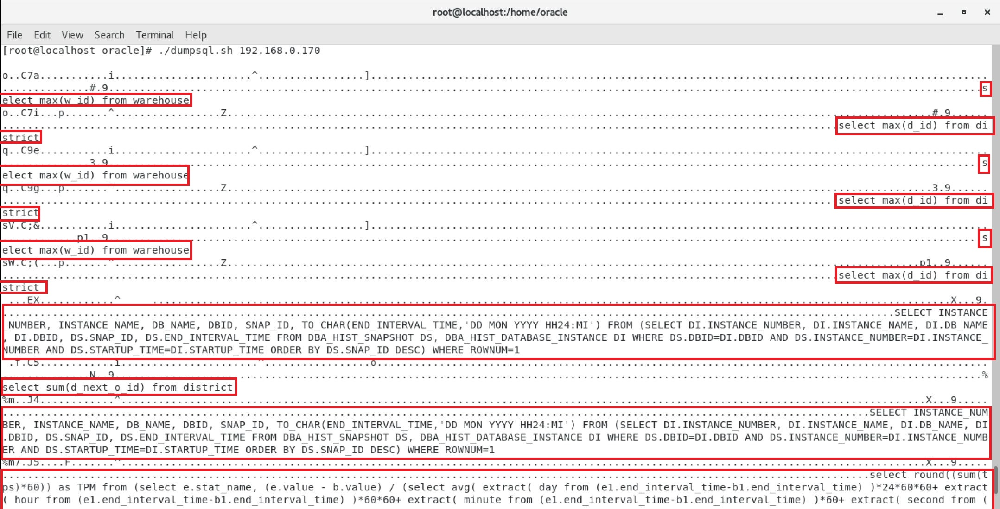
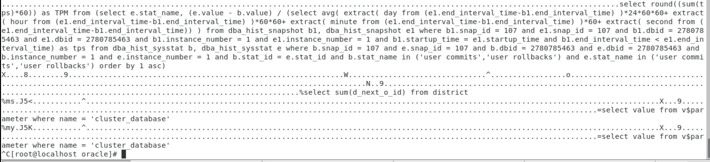
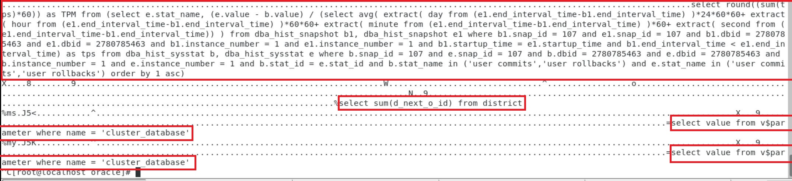

The tcpdump result clearly show that HammerDB only sent few SQL statements via the network. It was quite clear that the result from avdf was correct, it looked like an expected behavior, I suspected HammerDB may execute the same set of SQL statements million of times by only sending the SQL statements once to the database via network. HammerDB may reuse the same cursor million of times without sending the SQL text over the network over and over again, such that avdf could only capture the 1st time it send over the network with the full SQL text.

## Summary 
The result of DAM product which capture SQL statements from the network traffic could be different from what we expected, it actually depends on the application  and underlay database driver, If the application or database driver optimize itself and not sending full SQL text over the network everytime it execute a SQL statement, those DAM products may not able to capture every SQL executed by the application. It is the expected behavior of the product, but may not be the expectation for DAM.

